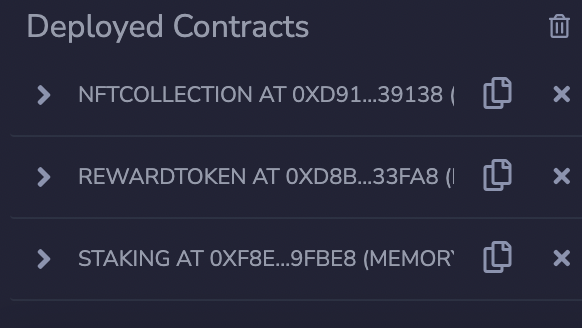
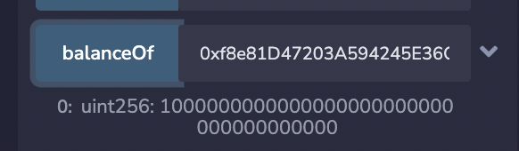
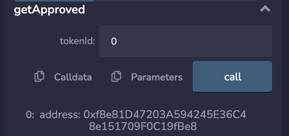

# Staking NFTs

Here we explain the steps of the solution. We also show an example of a staking transaction.

## Problem Statement
Write an NFT staking contract which stakes only specific allowed NFTs (white list addresses); reward token will be ERC20.
Contract should allow:
- Stake Collection (10 item)
- Stake Specific item in collection 
- Every 1 minute will reward 100 Token per Item
- Every 1 minute will reward 10000 Token per Collection

## Solution
We avoid storing arrays of NFTs or NFT collections. We instead rely on mappings to store everything required to make staking possible. These mappings include rewards, owners, staking time, etc. of the NFTs or NFT collections, in addition to a mapping to quantify the number of NFTs and NFT collections staked by each account.

- For staking individual NFTs, the staking contract should be the owner or an approved address to transfer the ownership of the said NFT to the staking contrat itself. When a user withdraws an NFT, the contract simply transfers back the NFT to its original owner.

- For staking NFT collections, the owner of the collection should be the staking contract. In the withdrawal phase, the ownership is returned back to the original owner.

- The key element in the staking contract is how the rewards are updated; this is accomplished by the modifier `updateReward(address account)`. By keeping track of the total number of NFTs and NFT collections staked by each account at all times, `updateReward` is called before any kind of transaction with `msg.sender`. This means the modifier is called on: claim, stake, withdraw, making the rewards consistent when used. Below is a code snippet of `updateReward`:

```
s_rewardsNft[account] =
            previousNftReward +
            (((block.timestamp - lastUpdateTime) *
                stakedNfts *
                REWARD_RATE_NFT *
                1e18) / 60);

s_rewardsCollection[account] =
    previousCollectionReward +
    (((block.timestamp - lastUpdateTime) *
        stakedCollections *
        REWARD_RATE_COLLECTION *
        1e18) / 60);
```


## Example:
All example below when executed on Remix.

We first deploy the three contracts: ERC721 collection, reward token, and finally the staking contract, in order. The order matters because we need to provide the address of the reward token and the white list NFT collections in the deployment of the staking contract. 

We then supply the staking contract with a large number of reward tokens (10 ** 18) so it can handle paying for the rewards. 



The balance of the staking contract (in reward tokens):



### Staking an NFT
We first mint a new NFT from the ERC721 collection to our address. The collection was included in the white list. 


Then we approve it to the staking contract. 




We stake the NFT having zero balance in reward tokens.


Let's check that the ownership of the NFT was successfully transferred after the staking. 


After a minute of staking we withdraw the NFT. It shoud be 100 * 10 ^ 18, which is the reward for staking an NFT for one minute.

Finally we claim the reward. We check the balance and the ownership of the NFT in the two images below.


### Staking an NFT
Let's send the reward tokens back to the staking contract and transfer the ownership of the NFT collection to the staking contract. Now we can stake the collection. 


We stake the NFT collection having the balance from the previous step in reward tokens. In other words we have 100 tokens. 


After almost a minute and a half of staking we withdraw the collection. This is close to 15000 * 10 ^ 18, which is the reward for staking an NFT collection for one minute. Below we check the balance of the staker after the withdrawal and the owner of the collection.

The balance is 15433 * 10 ** 18. It's almost (100 + 15000) * 10 ** 18.


The ownership is back to the staker.


