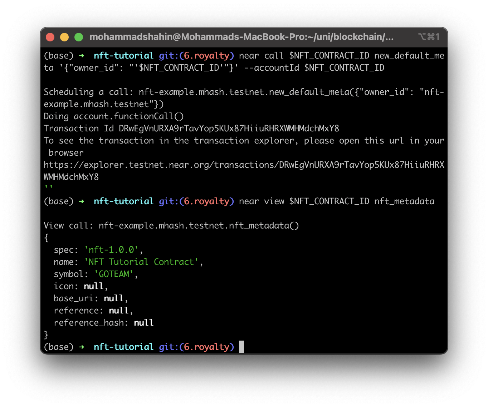
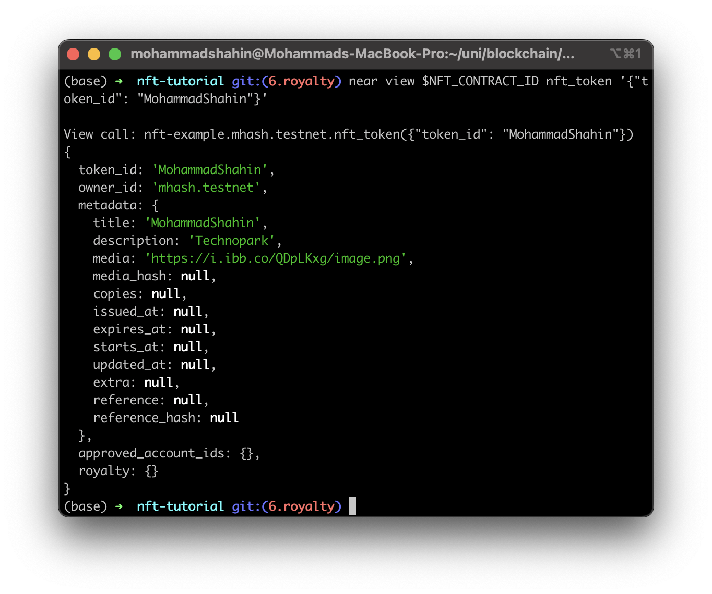
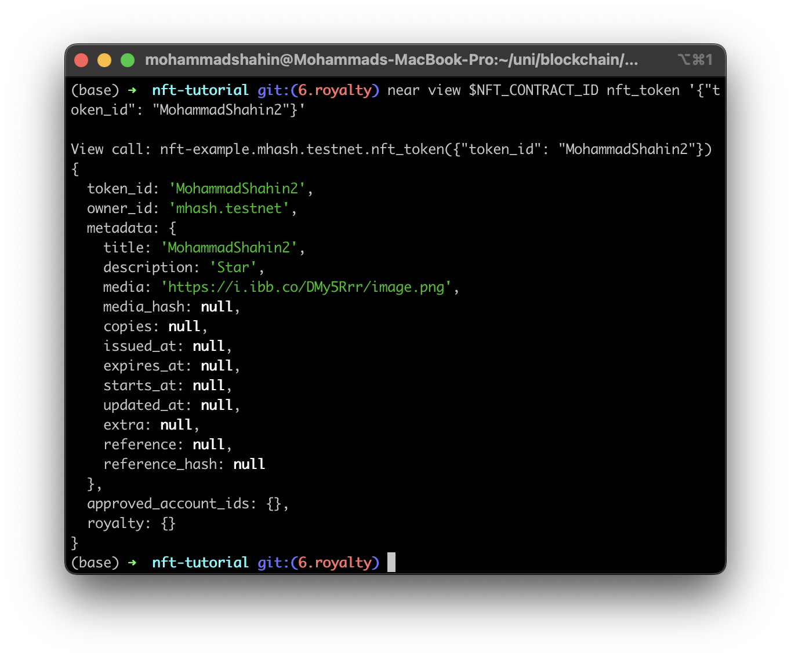
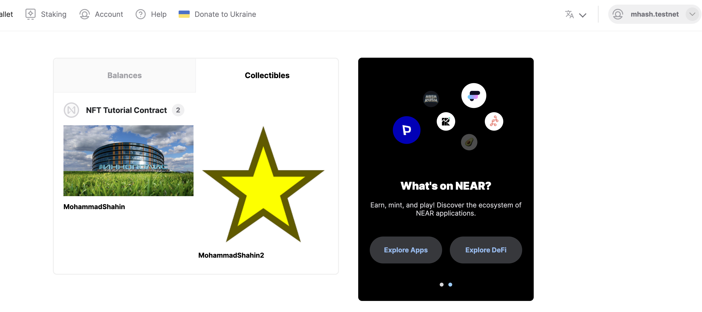

In this assignment we deploy an NFT contract in Near testnet. Then we mint two NFTs, one for technoparck and the other is a star. 

The NFT contract:

The first NFT:

The second NFT:

Owned NFTs:

Transactions: 
- Contract deployment: https://explorer.testnet.near.org/transactions/71D28YSq712Jv1HWxeieuyRDGG9Tni3skkyUJ5zaCLE6

- First NFT mint: https://explorer.testnet.near.org/transactions/FkJhUHkXm1CkVSdJztzVhaw3jmohim9SaWVRJ1PC5YN2

- Second NFT mint: https://explorer.testnet.near.org/transactions/HzrgUzC1ams8AmD4AbziKZinHVoZYWLJQ9kcBMEoFXpH

- Frist NFT transfer: https://explorer.testnet.near.org/transactions/8PveEQNM54e2goVr9W1ZMroqzD2sAJdA6HVNg4ZE3HLn

- Second NFT transfer: https://explorer.testnet.near.org/transactions/b5g3rafPuXBuUi9HeFtoSFkGNa8ZdeS1BgTGkmy8bmz

