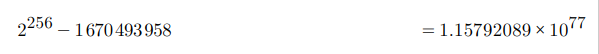

In this assignment we attack a contract used for time lock. Then we deploy another contract with safe math to solve the vulnerability.

## Deployment

We first deploy the contract. Then we deposit one ether. When the lockTime of that ether, it will be one week after the time we deposited.

## what is wrong with this contract? 

Arithmetic overflow. if we add 2**256 - locktime, we reach the maximum value of uint256, therefore the locktime becomes 0 and we may immediately withdraw the ethers.
Thus, we perform the safe math computations to determine the value that triggers overflow.

## Attack

Let's first find the value we need to add. Maximum integer - the current timestamp.

After the increase we access the lockTime.

## Fix

To solve the vulnerability, we use safe math for all types of arithmetic acomputations. Please check the contract in `contract.sol`
